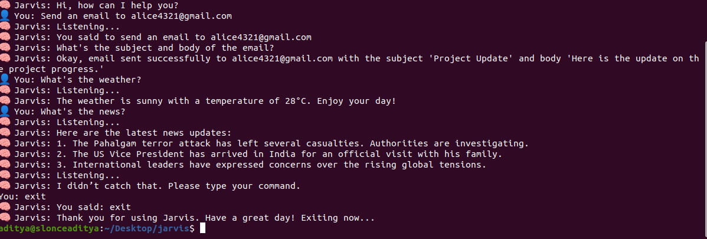

In my assistant project, several technologies are used to make the assistant functional. Below is an overview of the key technologies and tools used to build the system:

Speech Recognition:

Library Used: speech_recognition

Purpose: This library allows Jarvis to listen to and recognize spoken commands from the user. It uses various engines like Google Web Speech API, CMU Sphinx, and others for converting speech to text. The recognized speech is then processed to execute commands like sending emails, playing music, etc.

Text-to-Speech (TTS):

Library Used: pyttsx3

Purpose: This library converts text into audible speech, allowing Jarvis to respond to user queries audibly. Unlike cloud-based APIs, pyttsx3 works offline and is highly customizable in terms of speech rate, volume, and voice selection.

Sending Emails:

Library Used: smtplib (built-in Python library)

Purpose: smtplib is used to send emails through an SMTP (Simple Mail Transfer Protocol) server. Jarvis allows users to send emails by specifying the recipient, subject, and body.

Playing Music:

Library Used: playsound

Purpose: playsound is used to play audio files in .mp3 or other supported formats. Jarvis can play music files stored locally on the system as part of the "play music" command.

Weather Information:

Library Used: requests

Purpose: Jarvis fetches real-time weather data by sending requests to public weather APIs, such as OpenWeatherMap or WeatherAPI. The weather data (e.g., temperature, humidity, conditions) is then parsed and read out loud to the user.

News Updates:

Library Used: requests

Purpose: Jarvis can provide the latest news by sending requests to news APIs, such as NewsAPI or custom sources. The latest headlines are then spoken to the user.

OpenAI GPT Integration:

Library Used: openai (GPT-4 API)

Purpose: For advanced conversational capabilities, Jarvis can integrate with OpenAI’s GPT models. This allows Jarvis to respond intelligently to a wide range of user queries beyond simple commands. The integration is used to provide natural language processing (NLP) for tasks such as conversation, answering general knowledge questions, or even casual interactions.

System Integration (Optional):

Libraries/Technologies:

OS Integration: Python's os and subprocess libraries are used to interact with the underlying operating system, such as opening applications (e.g., Firefox) or controlling system settings.

Web Scraping/APIs: For more advanced use cases like fetching data from websites or APIs, Python libraries such as BeautifulSoup (for web scraping) or requests (for API calls) can be used.

Task Scheduling:

Library Used: time and threading

Purpose: Jarvis uses Python's built-in time and threading libraries to handle task scheduling and manage delays (e.g., waiting for 1 second between actions) to ensure a natural flow of interaction.

Additional Tools & Concepts:

Multithreading/Concurrency: Python’s threading module is used to allow Jarvis to handle multiple tasks simultaneously, like listening for voice input while performing other actions.

APIs: For various external data, Jarvis integrates with APIs (weather, news, email, etc.). APIs allow Jarvis to fetch real-time data and provide up-to-date information to the user.

Command Pattern: Jarvis uses a basic command pattern to parse and execute user commands, allowing for easy extensibility and adding more functionalities over time.

Overall Tech Stack Summary:

Python: The primary programming language used for building the assistant.

Speech Recognition: speech_recognition

Text-to-Speech: pyttsx3

Email Sending: smtplib

Music Playback: playsound

Weather and News APIs: requests

OpenAI GPT: For conversational capabilities

System and File Operations: os, subprocess, time, threading

